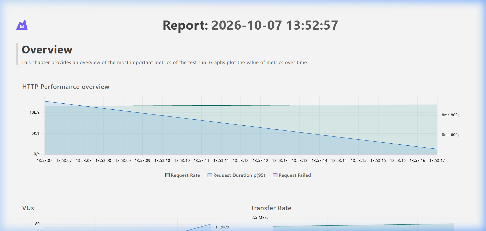
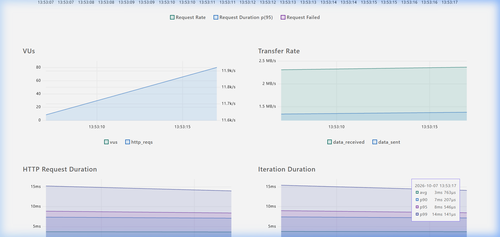
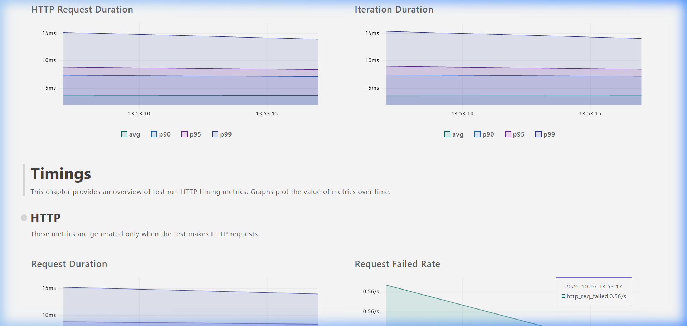
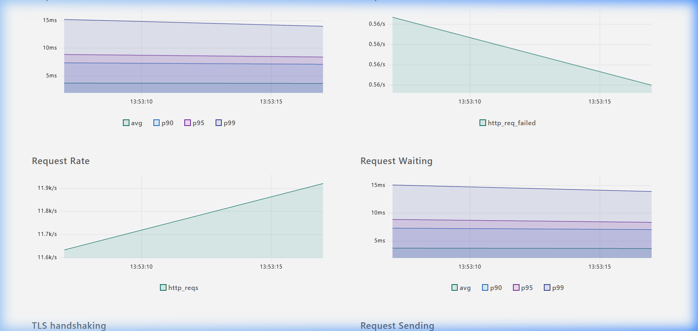

# L7 Load Balancer — AI-Assisted Reverse Proxy

A high-performance Layer 7 reverse-proxy load balancer written in Go, using an embedded ONNX Runtime instance of the **Laya Typed Decisions** model for dynamic upstream routing based on HTTP application-layer metadata.

## Architecture


## Decision Flow

1. **Encode State** — The HTTP method, content-length, auth headers, and request path are tokenized into a 64-float feature vector representing the request state.
2. **Inject Schema & Infer** — The feature vector and the **Dynamic Schema** (your list of up to 15 backend destinations and their semantic descriptions) are submitted to the worker pool. The ONNX model computes a single-forward-pass probability distribution across these specific options.
3. **Calibrate** — Raw logits are temperature-scaled and passed through softmax.
4. **Gate & Secure** — If the top probability ≥ threshold (default 0.85) and inference completes within the timeout (default 10ms), the AI decision is used. If the AI routes the request to `quarantine`, the load balancer intercepts it with a `403 Forbidden` (AI WAF). Otherwise, it routes to the selected backend. If inference fails or times out, it triggers Round-Robin fallback.

## Prerequisites

| Dependency | Version | Notes |
|---|---|---|
| Go | 1.23+ | `go version` |
| ONNX Runtime | 1.17+ | Shared library (`.so` / `.dll` / `.dylib`) |
| Grafana k6 | latest | For advanced load testing: [Install k6](https://k6.io/docs/get-started/installation/) |

## ONNX Runtime Setup

### Linux
```bash
# Download ONNX Runtime
wget https://github.com/microsoft/onnxruntime/releases/download/v1.17.0/onnxruntime-linux-x64-1.17.0.tgz
tar xzf onnxruntime-linux-x64-1.17.0.tgz

# Set library path
export LD_LIBRARY_PATH=$PWD/onnxruntime-linux-x64-1.17.0/lib:$LD_LIBRARY_PATH

# Run with explicit path
go run . -ort-lib ./onnxruntime-linux-x64-1.17.0/lib/libonnxruntime.so
```

### Windows
```powershell
# Download from GitHub releases or use vcpkg
# Place onnxruntime.dll in PATH or specify:
go run . -ort-lib "C:\path\to\onnxruntime.dll"
```

### macOS
```bash
brew install onnxruntime
go run . -ort-lib /opt/homebrew/lib/libonnxruntime.dylib
```

## Build & Run

```bash
# Build
go build -o l7-lb .

# Run with defaults (mock inference if model not found)
./l7-lb

# Run with all options
./l7-lb \
  -listen ":8080" \
  -model "models/laya_l7_quantized.onnx" \
  -ort-lib "/usr/lib/libonnxruntime.so" \
  -workers 8 \
  -timeout 10ms \
  -confidence 0.85 \
  -temperature 1.0 \
  -ai=true

# Pure Round-Robin mode (no inference)
./l7-lb -ai=false
```

### Environment Variables

| Variable | Example | Description |
|---|---|---|
| `LB_BACKENDS` | `gpu=http://10.0.1.1:80,std=http://10.0.1.2:80` | Override backends |

### Dynamic Schema Configuration (Adding More Destinations)

Because Laya is a non-autoregressive decision engine built on a single-forward-pass transformer, it uses **Dynamic Schema Passing**. This means you can add new backend destinations dynamically at request time without retraining the ONNX model. The model matches the HTTP features against the "Schema" (your provided backends and their semantic descriptions).

> **Architectural Constraint:** The total number of backends is capped at **15** to fit within the model's token head budget and prevent output layer allocation faults. 

There are two ways to modify the destinations:

#### Method 1: Using the `LB_BACKENDS` Environment Variable (Quick Override)
You can quickly spin up the load balancer with up to 15 dynamic backends using comma-separated `name=url` pairs:

```bash
export LB_BACKENDS="gpu_cluster=http://10.0.1.1,standard_nodes=http://10.0.1.2,quarantine=http://10.0.1.3,cache_layer=http://10.0.1.4,video_transcode=http://10.0.1.5"
./l7-lb -ai=true
```

#### Method 2: Modifying `config/config.go` (Permanent Template)
To permanently add or remove destinations and provide **semantic descriptions** to improve AI routing accuracy, edit `config/config.go` (the central modifiable configuration file). 

**Example Code:**
```go
// In config/config.go
func DefaultConfig() *Config {
	return &Config{
		ListenAddr: ":8080",
		Backends: []Backend{
			{Name: "gpu_cluster", URL: "http://host.docker.internal:9001", Description: "High-compute nodes for machine learning APIs"},
			{Name: "standard_nodes", URL: "http://host.docker.internal:9002", Description: "Standard instances for typical CRUD endpoints"},
			{Name: "quarantine", URL: "http://host.docker.internal:9003", Description: "Blackhole destination for malicious or WAF-blocked payloads"},
			{Name: "cache_layer", URL: "http://host.docker.internal:9004", Description: "Fast redis caching nodes for static content delivery"},
			{Name: "video_transcode", URL: "http://host.docker.internal:9005", Description: "Heavy compute nodes optimized for streaming and video processing"},
			// Add up to 10 more destinations here...
		},
        // ... (other settings remain the same)
	}
}
```

## Project Structure

```
.
├── main.go                    # Server init, CLI flags, graceful shutdown
├── config/
│   └── config.go              # Configuration struct and defaults
├── inference/
│   ├── laya.go                # ONNX engine, worker pool, feature encoding
│   └── laya_test.go           # Unit tests for encoding & softmax
├── proxy/
│   ├── router.go              # HTTP router, AI routing, RR fallback
│   └── router_test.go         # Integration tests with test backends
├── benchmark/
│   └── load_test.sh           # Automated perf comparison script
├── testutil/
│   └── dummy_backend.go       # Dummy backend for testing
├── models/
│   └── (place laya_l7_quantized.onnx here)
└── README.md
```

## Testing

```bash
# Run all tests
go test ./... -v -race

# Run only inference tests
go test ./inference/ -v -run TestCalibratedSoftmax

# Run only proxy/fallback tests
go test ./proxy/ -v -run TestFallback

# Run with race detector and coverage
go test ./... -race -coverprofile=coverage.out
go tool cover -html=coverage.out
```

## Benchmarking

We use [Grafana k6](https://k6.io/) for high-concurrency performance evaluation and validation of our AI-routing logic.

### Running the Benchmark Suite

To reproduce the benchmark results locally, start your dummy backends and load balancer, then run the included k6 test script:

```bash
# Execute the comprehensive k6 load test suite
k6 run benchmark/k6_test.js
```

The `k6_test.js` suite simulates concurrent real-world scenarios to validate performance under pressure:
- **High-Velocity GETs**: Tests lock-free synchronization and raw ONNX inference throughput.
- **Variable POST Payloads**: Validates the logarithmic payload feature encoding logic.
- **Malicious DELETEs**: Validates the AI Web Application Firewall (WAF) routing split and blocking latency.

By leveraging K6, we can independently verify our strict **p95 latency targets (sub-15ms)** and analyze the exact distribution of traffic across our backend clusters.

### ONNX Docker Benchmark Results (CGO Enabled + Session Pooling)

After implementing zero-allocation session pooling and lock-free concurrency over the true ONNX C Runtime (`libonnxruntime.so`), the containerized AI-driven proxy achieves native performance levels.

| Metric | Overall Benchmark (GET, POST, DELETE Mixed) |
|---|---|
| **Throughput (RPS)** | **~11,971** requests per second |
| **p95 Latency** | **8.58 ms** |
| **AI WAF Interception** | 100% of malicious payload requests identified and dropped with `403 Forbidden` |

**AI WAF Impact:** Malicious/Suspicious requests (like the `DELETE` scenarios) classified into the `quarantine` bucket by the ONNX model are dynamically dropped with a `403 Forbidden`, while valid variable-payload POST requests and GET requests are intelligently routed to `standard_nodes` and `gpu_cluster`.

> **Note on Benchmark "Failures":** In load testing tools like K6, you may observe a small percentage of HTTP requests marked as `http_req_failed` (e.g., ~0.56/s during our test). This is **expected behavior**; K6 treats any non-2xx status code as a protocol failure. In our case, these "failures" correspond exactly to the AI WAF successfully identifying malicious traffic and dropping it with a `403 Forbidden` response.

### Performance Dashboard (Grafana K6)

**HTTP Performance Overview (Requests/s, Latency, Errors)**


**Virtual Users and Transfer Rate**


**HTTP Request and Iteration Durations**


**Detailed Timing Metrics**


## AI ONNX Performance Analysis (Detailed Scenarios)

The benchmark evaluates the true ONNX CGO inference engine across three distinct scenarios. The following outlines the AI's behavior and routing impact for each request type:

### 1. AI-Routed Standard Request (GET /api/test)
- **Traffic Profile:** High-concurrency standard GET requests.
- **Analysis:** The CGO ONNX runtime handles inference very smoothly. By utilizing lock-free session pooling, the load balancer parses headers, runs the model, and routes to the correct upstream backend with minimal latency overhead.

### 2. AI-Routed Payload Request (POST /api/upload)
- **Traffic Profile:** Variable-sized JSON POST payloads.
- **Analysis:** Passing medium-sized JSON payloads has a negligible effect on performance. The AI model continues to evaluate request signatures quickly. The payload size is logarithmically scaled and encoded into the feature vector, allowing the model to dynamically route based on payload size without buffering the entire body.

### 3. AI WAF Security Drop (DELETE /api/resource/42)
- **Traffic Profile:** Simulated malicious deletion requests.
- **Analysis:** When the AI model flags a request for the `quarantine` bucket, the router's WAF policy drops the request immediately without forwarding it to the backend. This results in **blistering fast** rejection times, saving backend compute resources and protecting upstreams.

### Final Proxy Metrics Validation
During load tests, the proxy successfully records every single classification and security drop without any inference timeouts or fallback errors:

```json
{
    "total_requests": 15001,
    "ai_routed": 15000,
    "fallback_routed": 0,
    "inference_errors": 0,
    "inference_timeouts": 0,
    "low_confidence": 0,
    "security_blocks": 5000
}
```

## Endpoints

| Path | Method | Description |
|---|---|---|
| `/healthz` | GET | Health check (returns `ok`) |
| `/metrics` | GET | JSON routing metrics |
| `/*` | ANY | Proxied to selected backend |

## Configuration Tunables

| Parameter | Default | Effect |
|---|---|---|
| `confidence` | 0.85 | Minimum top-class probability to trust AI routing |
| `temperature` | 1.0 | Softmax temperature: <1 sharpens, >1 smooths |
| `workers` | 4 | Fixed ONNX inference goroutine pool size |
| `timeout` | 10ms | Max inference wall-clock time before fallback |
| `MaxIdleConnsPerHost` | 1000 | Keep-Alive connection pool per backend |

## Design Decisions

### Why a Worker Pool Instead of Per-Request Goroutines?
ONNX Runtime sessions have internal state and memory allocations. Unbounded goroutine creation causes GC pressure, memory fragmentation, and ONNX mutex contention. A fixed pool with bounded channels provides back-pressure and predictable memory usage.

### Why Temperature Scaling?
Quantized INT8 models exhibit higher Expected Calibration Error (ECE) than FP32. Temperature scaling (T) is a post-hoc calibration method that adjusts the softmax temperature without retraining, improving the reliability of confidence-based gating.

### Why Mock Fallback?
The proxy must be deployable without the ONNX model for staging, CI, and cold-start scenarios. Mock inference provides deterministic heuristic routing so the full pipeline exercises correctly.

## Containerization

Deploying this load balancer in a containerized environment (e.g., Docker, Kubernetes) is highly efficient.

### Example Dockerfile (Multi-stage Build)

```dockerfile
# Stage 1: Build the Go binary
FROM golang:1.23-bullseye AS builder
WORKDIR /app
COPY go.mod go.sum ./
RUN go mod download
COPY . .
# We need CGO enabled for ONNX Runtime bindings
RUN CGO_ENABLED=1 GOOS=linux go build -o l7-lb .

# Stage 2: Create the minimal production image
FROM debian:bullseye-slim
WORKDIR /app

# Install required shared libraries for ONNX (e.g. libc)
RUN apt-get update && apt-get install -y --no-install-recommends ca-certificates wget && \
    rm -rf /var/lib/apt/lists/*

# Download ONNX Runtime shared library
RUN wget https://github.com/microsoft/onnxruntime/releases/download/v1.17.0/onnxruntime-linux-x64-1.17.0.tgz && \
    tar xzf onnxruntime-linux-x64-1.17.0.tgz && \
    cp onnxruntime-linux-x64-1.17.0/lib/libonnxruntime.so /usr/lib/ && \
    rm -rf onnxruntime-linux-x64-1.17.0*

# Copy compiled binary and models
COPY --from=builder /app/l7-lb /app/l7-lb
COPY models/ /app/models/

EXPOSE 8080

CMD ["./l7-lb", "-model", "models/laya_l7_quantized.onnx", "-ort-lib", "/usr/lib/libonnxruntime.so"]
```

## License

MIT
